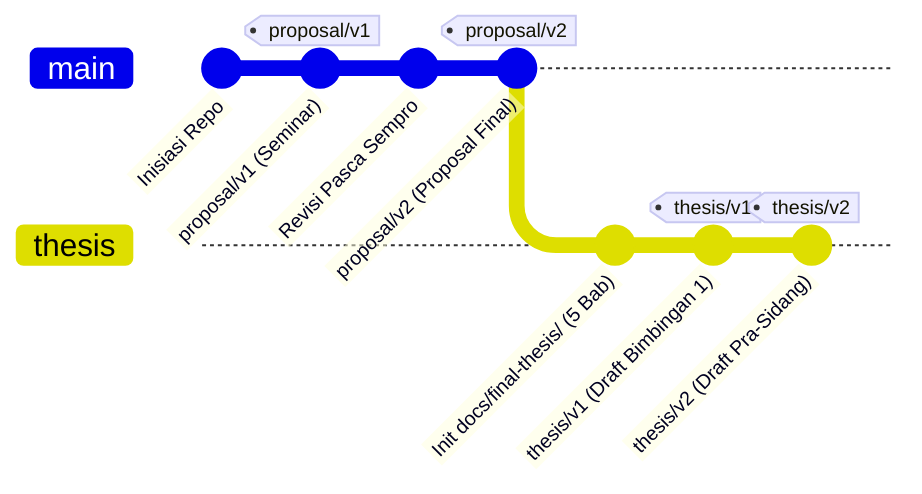

# Strube Harmonic Evaluation Framework & Reproducible Research Suite

Repositori ini berfungsi ganda (*dual-purpose reproducible research artifact*):

1. 🔬 **Algorithmic Evaluation Framework**: Benchmark otomatis berbasis Python & `music21` untuk menguji kepatuhan model AI musik simbolik (**DeepBach**, **Coconet**, dan **NotaGen**) terhadap kaidah harmoni fungsional Barat menurut Gustav Strube (1928).
2. 📄 **Parameterized LaTeX Document Suite**: Toolchain otomasi LaTeX untuk menghasilkan naskah akademik (Proposal & Skripsi), slide presentasi Beamer, catatan presenter, matriks QnA, serta generator *side-by-side diff* antar-versi revisi.

---

## Struktur Repositori

```text
.
├── docs/
│   ├── proposal-phase/         # Fase Proposal (Milestone: proposal/v1, proposal/v2)
│   │   ├── assets/             # Class (.cls), logo ISI, bibliography (.bib)
│   │   ├── proposal/           # Naskah proposal (Bab 1–3 + Jadwal)
│   │   └── presentation/       # Beamer slides, presenter notes, QnA matrix
│   └── final-thesis/           # Fase Skripsi Final (Milestone: thesis/v1, ...)
│       ├── thesis/             # Naskah skripsi lengkap (Bab 1–5 + Lampiran)
│       └── presentation/       # Slide beamer ujian sidang skripsi
├── experiments/                # Pipeline generasi MIDI, evaluasi, & visualisasi
│   ├── scripts/                # run_experiment, run_evaluation, plot_results
│   └── strube_conditions.json  # Matriks kondisi batasan (A, B, C, D)
├── scripts/                    # Helper scripts (bootstrap_models, compile, diff)
├── tests/                      # Face validity unit tests (Bach vs Wrong harmony)
├── outputs/                    # Output MIDI generasi, MASTER_RESULTS.csv, grafik
├── Makefile                    # Target otomasi riset & build dokumen
├── run_all.py                  # Single entrypoint pipeline eksperimen
└── strube_evaluator.py         # Modul inti evaluasi kaidah harmoni Strube
```

---

## Siklus Hidup Dokumen & Strategi Versioning

Repositori ini menerapkan **Namespaced Milestone Tags** untuk membedakan tahapan akademik:



- **`proposal/v1`**: Naskah yang diajukan ke seminar proposal.
- **`proposal/v2`**: Naskah proposal **final** pasca revisi sempro & pengesahan pembimbing skripsi. *Fase proposal di-freeze di sini.*
- **`thesis/v1`**: Draf pertama naskah skripsi 5 Bab yang diajukan ke Dosen Pembimbing Skripsi.
- **`thesis/v2` / `thesis/v3`**: Draf revisi bimbingan menuju sidang tugas akhir.

---

## Persyaratan Sistem

Pastikan perangkat lunak berikut telah terpasang di sistem:

| Software | Versi Minimum | Keterangan & Cara Cek |
| :--- | :--- | :--- |
| **Git** | Bebas | `git --version` |
| **Python** | 3.10 | `python3 --version` |
| **uv** | Bebas | `uv --version` (Fast Python package manager) |
| **Node.js** | 18+ | `node --version` (Diperlukan untuk runtime Magenta/Coconet) |
| **latexmk** | Bebas | `latexmk --version` (Distribusi LaTeX, misal MacTeX / TeX Live) |
| **envsubst** | Bebas | `envsubst --version` (Bagian dari paket `gettext`) |

Instalasi `uv` jika belum tersedia:
```bash
curl -LsSf https://astral.sh/uv/install.sh | sh
```

---

## Instalasi & Setup Lingkungan

1. **Clone Repositori**:
   ```bash
   git clone <URL_REPO>
   cd symbolic-music-harmony-comparative-study
   ```

2. **Inisialisasi Virtual Environment & Dependensi**:
   ```bash
   uv venv .venv --python 3.10
   source .venv/bin/activate
   uv pip install -r requirements.txt
   ```

3. **Bootstrap Model & Library Pihak Ketiga**:
   ```bash
   make setup
   ```
   *Perintah ini akan mengunduh repositori DeepBach & NotaGen ke `models/` serta menginstal dependensi Node.js untuk Coconet.*

4. **Konfigurasi Variabel Lingkungan / Metadata**:
   ```bash
   cp .env.example .env.local
   ```
   Buka `.env.local` dan sesuaikan dengan identitas peneliti, nomor induk (NIM/NIP), serta institusi Anda. File `.env.local` bersifat lokal dan diabaikan oleh Git untuk melindungi privasi.

---

## Menjalankan Pipeline Riset & Eksperimen

### 1. Uji Validitas Muka (Face Validity)
Sebelum menjalankan generasi, pastikan instrumen evaluasi berfungsi dengan benar:
```bash
make test
```
*Menguji Bach Chorale asli (BWV 66.6) $\rightarrow$ harus menghasilkan skor tinggi, dan harmonisasi paralel sengaja dibuat salah $\rightarrow$ harus terdeteksi pelanggaran.*

### 2. Menjalankan Full Pipeline Riset
Jalankan seluruh tahapan eksperimen secara end-to-end:
```bash
make exp
# atau
uv run python run_all.py
```

### 3. Opsi Eksperimen Lanjutan
```bash
# Smoke test cepat (1 sampel per kondisi per model)
uv run python run_all.py --samples 1

# Dry-run: Cek matriks prompt tanpa melakukan generasi
uv run python run_all.py --dry-run

# Evaluasi saja (lewati tahap generasi jika output MIDI sudah ada)
uv run python run_all.py --skip-generation

# Jalankan generasi model secara paralel (butuh RAM/VRAM cukup)
uv run python run_all.py --parallel-models
```

Output eksperimen tersimpan di direktori `outputs/`:
- `outputs/deepbach/`, `outputs/coconet/`, `outputs/notagen/` : Berkas MIDI hasil generasi.
- `outputs/MASTER_RESULTS.csv` : Hasil evaluasi detail per sampel.
- `outputs/SUMMARY_TABLE.csv` : Rata-rata *Strube Score* per model per kondisi.
- `outputs/strube_evaluation_results.png` : Grafik komparatif siap publikasi.

---

## Membangun Dokumen Akademik (LaTeX Pipeline)

Gunakan `make` untuk meng-compile dokumen LaTeX yang secara otomatis mengisi data dari `.env.local`:

### Fase Proposal (`docs/proposal-phase/`)
```bash
make proposal        # Build naskah proposal PDF (docs/proposal-phase/proposal/main.pdf)
make slides          # Build slide presentasi Beamer (presentation.pdf)
make notes           # Build naskah presenter berbasis slide (presentation_notes.pdf)
make qna             # Build dokumen antisipasi tanya jawab ujian (qna.pdf)
make proposal-phase  # Build seluruh artefak proposal sekaligus
```

### Fase Skripsi Final (`docs/final-thesis/`)
```bash
make thesis          # Build naskah skripsi lengkap 5 Bab (docs/final-thesis/thesis/main.pdf)
make final-phase     # Build seluruh artefak fase skripsi
```

### Membersihkan Berkas Build
```bash
make clean           # Menghapus berkas cache dan temporary LaTeX
```

---

## Visualisasi Perubahan & Side-by-Side Diffing

Repositori ini dilengkapi *side-by-side diff generator* untuk membandingkan revisi naskah antar-versi Git secara visual:

```bash
# Membandingkan revisi proposal versi 1 dengan versi 2
make diff proposal/v1 proposal/v2

# Membandingkan proposal final dengan draft skripsi awal
make diff proposal/v2 thesis/v1

# Membandingkan antar-draft bimbingan skripsi
make diff thesis/v1 thesis/v2
```
Hasil diff PDF akan disimpan di `scratch/proposal_diff.pdf`.

---

## Menggunakan Repositori Ini Sebagai Template

Jika Anda adalah peneliti atau mahasiswa yang ingin memanfaatkan framework ini:

1. **Gunakan Evaluator untuk Model AI Anda**: Masukkan berkas MIDI model Anda ke `strube_evaluator.py`:
   ```bash
   uv run python strube_evaluator.py path/to/sample.mid
   ```
2. **Gunakan Template Dokumen**: Sesuaikan template LaTeX di `docs/` dengan pedoman penulisan institusi Anda, dan modifikasi variabel institusi di `.env.local`.

---

## Troubleshooting

| Kendala | Penyebab & Solusi |
| :--- | :--- |
| `uv: command not found` | Pasang `uv` via installer resmi lalu restart terminal. |
| `envsubst: command not found` | Pasang `gettext` (`brew install gettext` di macOS / `apt install gettext` di Linux). |
| `latexmk: command not found` | Pastikan distribusi TeX (MacTeX / TeX Live) terpasang di PATH sistem. |
| `No module named 'DatasetManager'` | Jalankan `make setup` untuk memastikan repositori model ter-clone. |
| Coconet `npm install` gagal | Pastikan Node.js 18+ terpasang dan koneksi internet stabil. |
